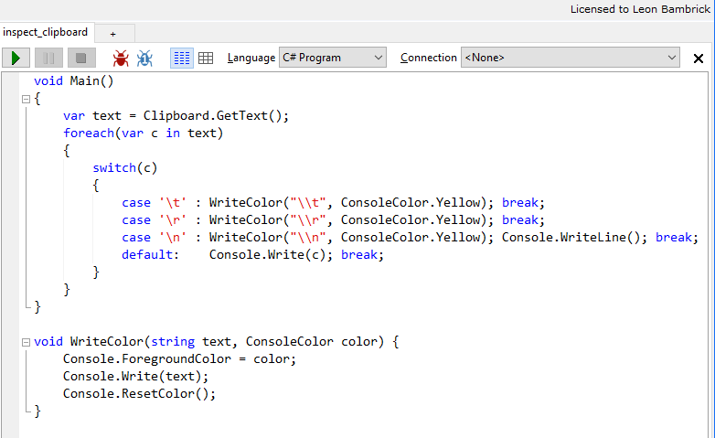

# Inspect clipboard with linqpad

While testing the upcoming [NimbleText](http://NimbleText.com) enhancements I need to be able to inspect the line endings on the clipboard, so I've put this LinqPad script into my [linqpad script folder](invoke_linqpad_commandlet.md)

And now, thanks to the magic of the `Invoke-LinqPadScript` commandlet, if I type `linq inspect_clipboard` I will instantly see, color coded, what special characters are on the clipboard:

Code (requires a reference to, and "Additional namespace import" of, `System.Windows.Forms` (hit F4)

    void Main()
    {
        var text = Clipboard.GetText();
        foreach(var c in text)
        {
            switch(c)
            {
                case '\t' : WriteColor("\\t", ConsoleColor.Yellow); break;
                case '\r' : WriteColor("\\r", ConsoleColor.Yellow);	break;
                case '\n' : WriteColor("\\n", ConsoleColor.Yellow);	Console.WriteLine(); break;
                default:	Console.Write(c); break;
            }
        }
    }

    void WriteColor(string text, ConsoleColor color) {
        Console.ForegroundColor = color;
        Console.Write(text);
        Console.ResetColor();
    }

## See also

 * [Run Linqpad scripts from the command-line](run_linqpad_scripts_from_commandline.md)
 * [Invoke a LinqPad Script with Invoke-LinqPadScript CommandLet](invoke_linqpad_commandlet.md)
