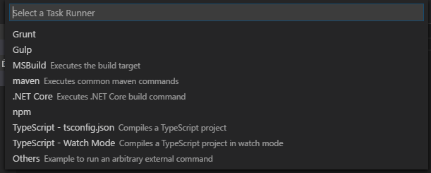

# Getting started with typescript

    npm install -g typescript

Note you can install a specific version with [npm](../npm/install_npm.md) by running, for example:

    npm install typescript@2.0.0.

Here's the output I saw:

    C:\Users\Leon\AppData\Roaming\npm\tsserver -> C:\Users\Leon\AppData\Roaming\npm\node_modules\typescript\bin\tsserver
    C:\Users\Leon\AppData\Roaming\npm\tsc -> C:\Users\Leon\AppData\Roaming\npm\node_modules\typescript\bin\tsc
    C:\Users\Leon\AppData\Roaming\npm
    +-- typescript@2.0.10

See if `tsc` (the typescript compiler) was installed by running:

    tsc --help

Result will be something like this:

    Version 1.0.3.0
    Syntax:   tsc [options] [file ..]

    Examples: tsc hello.ts
              tsc --out foo.js foo.ts
              tsc @args.txt

    Options:
      --codepage NUMBER             Specify the codepage to use when opening source files.
      -d, --declaration             Generates corresponding .d.ts file.
      -h, --help                    Print this message.
      --mapRoot LOCATION            Specifies the location where debugger should locate map files instead of generated locations.
      -m KIND, --module KIND        Specify module code generation: 'commonjs' or 'amd'
      --noImplicitAny               Warn on expressions and declarations with an implied 'any' type.
      --out FILE                    Concatenate and emit output to single file.
      --outDir DIRECTORY            Redirect output structure to the directory.
      --removeComments              Do not emit comments to output.
      --sourcemap                   Generates corresponding .map file.
      --sourceRoot LOCATION         Specifies the location where debugger should locate TypeScript files instead of source locations.
      -t VERSION, --target VERSION  Specify ECMAScript target version: 'ES3' (default), or 'ES5'
      -v, --version                 Print the compiler's version: 1.0.3.0
      @<file>                       Insert command line options and files from a file.

## To use TypeScript

Create a simple javascript file, with a .ts extension, e.g.

log.ts:

    console.log("hi");

then transpile it into a js file, by running `tsc log.ts` -- the result is a javascript file, `log.js` which in this case is identical.

Done that!? Woot! You're a typescript developser!

So i load it up in visual studio code, by running "code.exe" from the commandline.

## Problem: running old version despite installing new version.

The output from `tsc --help` above said my tsc version was `1.0.3.0`, even though the installer said "`typescript@2.0.10`"

When I started vs code it straight away gave me this warning:

> Version mismatch! global tsc (1.0.3.0) != VS Code's language service (2.0.10). Inconsistent compile errors might occur

I looked further into it, by running "Get-Command tsc" (in powershell) and found tsc was being loaded from:

    C:\Program Files (x86)\Microsoft SDKs\TypeScript\1.0\tsc.exe

Why? Because some earlier SDK i'd installed had added that folder to my [path](../powershell/PATH.md).

So that old exe was found, instead of finding the one installed by npm, which is located here:

    C:\Users\Leon\AppData\Roaming\npm\tsc.cmd

So I edited my path to *remove* that folder from it (notes on [editing environment variables here...](../windows/environment_variables.md))

## Resume getting started....

You can compile multiple files at once:

    tsc *.ts

That will produce one js file for each ts file.

You can combine all the ts files into one js file.

    tsc *.ts --out example.js

But howbout this for clever... you can tell typescript to watch files and recompile as soon as 1 changes...

    tsc *.ts --out example.js --watch

## Doing more with visual studio code.

The first step in working on a TypeScript project in visual studio code is to add a `tsconfig.json` file to the root of the project.

It can be an empty object, like this:

    {
    }

But why not spruce it up a bit by adding something like this...

    {
         "compilerOptions": {
            "target": "es5",
            "module": "commonjs",
            "sourceMap": true
        }
    }

Choices under 'target' are currently:

    * ES3 (default)
    * ES5
    * ES6/ES2015
    * ES2016
    * ES2017
    * ESNext

Knowing what these mysterious things mean is part of the magic of being a web developer in 2016. Know one knows the whole path around the elephant.

## Configure a task runner in vs code...

Press `ctrl shift P` (and do it sort of casually, like you knew that was the right thing to do all along)

That brings up what is known as the command palette. (You can also find it under the 'View' menu, where it helpfully reminds you that `ctrl shift p` is the key combo to know)

Type: `tasks: Configure Task Runner` (or any shortest unique substring of that command)...

...and vs code will lead you toward choosing the right type of `tasks.json` file for your nascent project, and then create it for you (in a .vscode folder)

You can learn more about the `tasks.json` file format by visiting <http://code.visualstudio.com/docs/editor/tasks> -- but ain't nobody got time for that.

## Sources

 * <http://blog.teamtreehouse.com/getting-started-typescript>
 * <https://code.visualstudio.com/Docs/languages/typescript>
 * <http://code.visualstudio.com/docs/editor/tasks>

## See also

 * [npm](../npm/install_npm.md)
 * [path](../powershell/PATH.md)
 * [editing environment variables](../windows/environment_variables.md)
